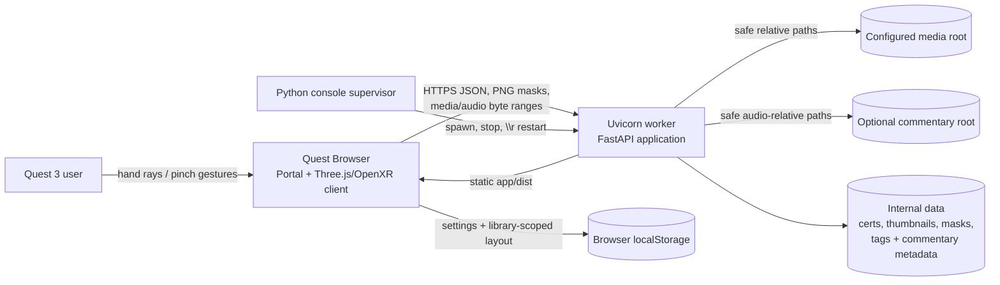
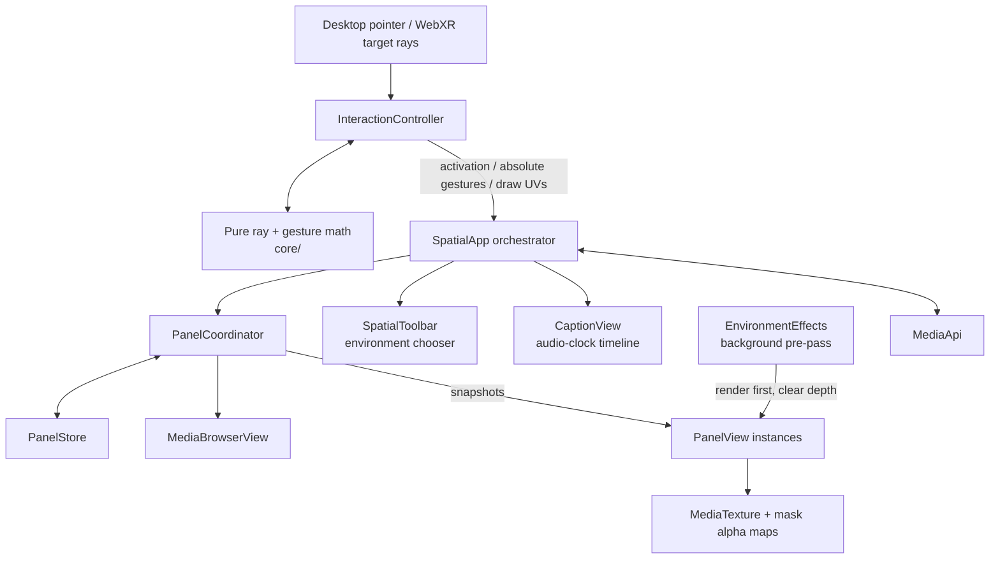

# Souvenir architecture

This document describes how Souvenir's local FastAPI server and browser-based
Three.js/OpenXR client fit together. It is intended for contributors extending
the media APIs, spatial UI, input system, or persistence model.

## Architectural goals

Souvenir is designed around a few constraints:

- Media stays on the local computer and local network.
- Meta Quest 3 passthrough and hand input are the primary runtime target.
- Browser-native media is streamed directly; there is no transcoding pipeline.
- Filesystem paths remain relative to a configured media root.
- Renderer-independent state and geometry live in small core modules so they
  can be tested without an XR headset.
- Durable masks, shared tags, commentary assignments, captions, and per-sound
  volume belong to the server; per-device UI/layout preferences belong to
  browser storage.

## System context



The Python supervisor and Uvicorn worker are separate processes. Restarting the
worker reloads code and static assets while browser clients remain open on the
same address.

## Repository structure

| Path | Responsibility |
|---|---|
| `server/` | FastAPI application, media/commentary filesystem boundaries, TLS, thumbnails, masks, tags, commentary metadata, scan progress, and supervision |
| `app/` | Portal HTML/CSS, renderer-independent client core, Three.js scene, OpenXR input, and bundled assets |
| `test/server/` | Pytest unit and API tests |
| `test/client/` | Vitest tests for state, geometry, persistence, and media-layout logic |
| `test/browser/` | Playwright portal and real WebGL scene flows |
| `doc/` | User and architecture documentation |

---

## Server architecture

### Process and startup model

`start.sh` validates `SOUVENIR_MEDIA_HOME` and runs:

```text
python -m server --host 0.0.0.0 --port <port> --https
```

`server.__main__` has two modes:

1. **Supervisor mode** owns the terminal, reads console commands, and starts a
   child Python process.
2. **Worker mode** (`--worker`) creates and runs the Uvicorn/FastAPI
   application.

The literal console command `\r` gracefully stops the worker and starts a new
one with the same Python executable, host, port, media-home environment, HTTPS
flag, and certificate directory. `Ctrl+C` stops both processes. Worker shutdown
has a bounded graceful period followed by targeted forced termination.

The supervisor logic is split between:

- `server/__main__.py`: CLI, worker lifecycle, stdin thread, and OS signals.
- `server/supervisor.py`: worker command construction and injectable lifecycle
  helpers used by tests.

### Configuration, library identity, and TLS

`server/config.py` reads:

- `SOUVENIR_MEDIA_HOME` (required existing directory)
- `SOUVENIR_COMMENTARY_DIR` (optional existing audio directory)
- `SOUVENIR_PORT` (default `8000`)

It also derives a versioned SHA-256 `library_id` from the canonical resolved
root. The ID does not reveal the raw path and lets the client distinguish, for
example, `/g` from `/g/Intel`.

For HTTPS, `server/certificates.py` maintains a local CA and server identity.
The server certificate includes localhost and discovered LAN addresses. New
addresses cause a server-certificate reissue under the existing trusted CA.
Generated files normally live in `<media root>/.souvenir-certs/`.

### FastAPI composition and lifecycle

`server/application.py:create_app()`:

1. Resolves and validates the media root.
2. Creates a `LibraryScanService`.
3. Registers API routes from `server/routes.py`.
4. Registers static app/SPA fallback routes.
5. Starts the first-load scan from the FastAPI lifespan.

Shared process state is intentionally small:

- `app.state.media_home`
- `app.state.library_id`
- `app.state.library_scan`

The library scan runs in a daemon thread. `LibraryScanProgress` protects mutable
progress with a lock and exposes scanning/ready/error state, file/media/folder
counts, current relative path, messages, and timestamps. The scan is for startup
observability; directory APIs still read the filesystem directly rather than
querying a persistent index.

### Filesystem and media boundary

`server/media.py` is the central trust boundary:

- Only JPEG, PNG, WebP, GIF, MP4, and WebM are media.
- Requests must use relative paths.
- Absolute paths, drive paths, `.` components, and `..` traversal are rejected.
- Strict resolution must remain under the configured root, preventing symlink
  escapes.
- Internal directories are excluded from scans/listings and rejected by direct
  media routes:
  - `.souvenir-certs`
  - `.souvenir-thumbnails`
  - `.souvenir-masks`
- The internal `.souvenir-tags.json` state file is likewise excluded from media
  listings and direct file/thumbnail access.

Metadata contains relative path, type, size, modification time, and generated
file/thumbnail URLs. The server does not expose host filesystem paths as media
identifiers.

### API surface

| Endpoint | Responsibility |
|---|---|
| `GET /api/health` | Worker health, media-home diagnostic, and `library_id` |
| `GET /api/library-status` | First-load scan progress plus `library_id` |
| `GET /api/tree` | Recursive directory metadata |
| `GET /api/media?path=` | One directory's child directories and media entries |
| `GET, HEAD /api/file?path=` | Full or single-range media streaming |
| `GET /api/thumbnail?path=` | Cached JPEG image thumbnail or video placeholder |
| `GET /api/mask-info?path=` | No-store mask presence, blur, timestamp, and URL |
| `GET /api/mask?path=` | Raw persisted erase-mask PNG |
| `PUT /api/mask?path=&blur=` | Validate and save normalized PNG + blur metadata |
| `DELETE /api/mask?path=` | Idempotently remove a media mask |
| `GET, POST /api/tags` | List or create shared tag definitions |
| `PATCH, DELETE /api/tags/{id}` | Rename or delete a stable tag definition |
| `GET, PUT /api/media-tags?path=` | Read or replace one media file's tag IDs |
| `PUT /api/media-tags/bulk` | Atomically replace tag IDs for multiple validated media paths |
| `GET /api/commentary` | Commentary availability and recursive audio metadata |
| `GET, HEAD /api/commentary/file?path=` | Full or ranged browser-native audio |
| `GET, PUT /api/commentary-tags?path=` | Read or replace one sound's shared tag IDs |
| `GET, PUT /api/commentary-caption?path=` | Read or replace one sound's caption sequence |
| `GET, PUT /api/commentary-volume?path=` | Read or replace one sound's normalized 0–1 volume |

Video seeking depends on byte-range responses. Valid ranges return `206` with
`Content-Range`; invalid ranges return `416`.

### Thumbnails and masks

`server/thumbnails.py` caches path-hashed JPEGs under
`.souvenir-thumbnails`. Image thumbnails use Pillow and EXIF transpose. Videos
use a generated placeholder, avoiding an FFmpeg runtime dependency.

`server/masks.py:MaskStore` stores a raw erase-mask PNG and JSON metadata under
`.souvenir-masks`, keyed by a SHA-256 of the normalized relative media path.
Uploads are:

- limited to 16 MiB;
- required to be PNG;
- limited to 2048 pixels per dimension;
- decoded, validated, and re-encoded as RGBA;
- written through exclusive temporary files, `fsync`, and `os.replace`;
- rolled back when a paired metadata update fails.

An in-process `RLock` coordinates reads/writes. The PNG/JSON pair has
best-effort rollback consistency but is not a cross-process transactional data
store; a database-backed `MaskStore` would be the natural extension for
multi-writer deployments.

`server/tags.py:TagStore` keeps stable tag definitions, separate media and
commentary path assignments, commentary caption strings, and per-sound volume
values in the atomic single-file store `.souvenir-tags.json`. Versions 1–3
migrate to schema version 4 without losing assignments or captions. Captions
are trimmed, control-character checked, and limited to 5000 characters; volume
is constrained to 0–1 and omitted from storage at its default of 1. Tag names
are trimmed, length/control-character checked, limited to 100 definitions, and
case-insensitively unique. Renames retain IDs; deletes remove the ID from every
assignment namespace. Media directory listings and commentary metadata include
canonical ordered `tag_ids`.

`server/commentary.py` treats the optional commentary directory as an
independent filesystem boundary. It recursively discovers supported audio,
skips hidden/symlink entries, returns only relative metadata plus server-owned
tags, captions, and volume, and uses the same range-streaming response path as
media.
Supported types are WAV, MP3, OGG/Opus, M4A/AAC, and WebM.

### Static client

The server prefers `app/dist/` and falls back to `app/` during development.
Existing files use `FileResponse`; other safe paths return `index.html` for SPA
fallback. Static paths are independently constrained to the static root.

---

## Client architecture

### Portal and startup

`app/src/main.js` creates `HomeController`, which owns the non-XR DOM:

- polls `/api/library-status` during startup scanning;
- loads health and validates `library_id`;
- loads the collapsible directory tree;
- persists selected folders, autoplay, slideshow interval, and caption display
  size/transparency/distance;
- manages shared tag definitions plus compact commentary filtering, test
  playback, tags, captions, and per-sound volume;
- detects immersive AR support;
- gates Browse Mode, Desktop Preview, and XR entry until the library is ready.

Browse and tagging controllers are loaded on first entry to their respective
modes. The spatial runtime remains eagerly available so XR/preview launch can
construct its debug and interaction surface synchronously after activation.

`app/src/services/media-api.js:MediaApi` is the HTTP boundary. It wraps server
JSON calls, media/thumbnail URLs, mask GET/PUT/DELETE operations, tag-definition
CRUD, media/commentary tag assignments, commentary captions/volume, commentary
listing, and commentary file URLs. API errors become explicit `MediaApiError`
instances.

Portal settings use schema version 2 under the `souvenir.settings` local-storage
key. Older values receive caption-display defaults during reconciliation, and
directory selections are reconciled against the current server tree.
The portal Commentary card owns a separate, explicit-activation HTML audio
element for testing sounds and editing their shared tags, captions, and volume.
Its transient filter state supports AND matching over shared tag IDs plus a
mutually exclusive untagged-only mode; deleted definitions are reconciled out
of the filter.
The viewport-bounded portal uses a compact title bar and a fitted two-by-two
configuration grid. Individual panels own overflow; narrow viewports switch the
same panels to a one-open-at-a-time accordion. Commentary rows keep file
metadata to two lines, render assigned tags inline, and open tag/caption editors
as mutually exclusive fixed overlays so editing never changes row height.
Commentary failures remain local and do not gate gallery launch.

`app/src/ui/browse-controller.js:BrowseController` owns the non-Three.js Browse
Mode workspace. It reuses selected-directory constraints and `MediaApi`
directory responses, renders folder/media cards, manages keyboard and range
selection, and switches between an image transform viewer and native HTML video.
Pure selection, bulk-tag, and bounded image-transform calculations live in
`app/src/core/browse.js`. Multi-file edits send complete per-file assignments to
`PUT /api/media-tags/bulk`; `TagStore` validates the complete batch and writes
the metadata file once under its lock, so invalid input cannot leave a partially
updated selection.

### Spatial runtime and ownership

`SpatialApp` in `app/src/scene/spatial-app.js` is the runtime orchestrator. It
owns:

- Three.js scene, camera, alpha-enabled renderer, and desktop `OrbitControls`;
- WebXR session startup (`immersive-ar`, `local-floor`, optional hand tracking);
- environment background pass;
- main `SpatialToolbar`;
- `InteractionController`;
- feature controllers and the top-level render schedule.

Feature controllers keep independent state machines out of the renderer
composition root:

- `CommentaryController` owns scoring, audio lifecycle, volume, and the
  camera-facing `CaptionView`;
- `ScenePlaybackController` owns scene CRUD, shot selection/capture, playback
  timing, transitions, and scene-state notifications.
- `MaskWorkflow` owns erase-mask/depth caches, stale-response generations,
  editor state, ADM/automatic-mask polling, and panel application.
- `PanelCoordinator` owns the serializable `PanelStore`, change-aware
  `PanelView` reconciliation, `MediaBrowserView`, panel playlists/slideshows,
  media request generations, inline tag saves, gestures, and layout persistence.

The panel store publishes a serializable snapshot plus a compact change
descriptor. `SpatialApp` caches that subscribed snapshot and reconciles only the
affected panel views; callers should not poll and clone the store from the
animation loop. Intent-level operations such as pose changes and media selection
are atomic so one interaction produces one reconciliation and one persistence
schedule.

Renderer-independent state remains in `app/src/core/`; Three.js objects remain
in `app/src/scene/`. Transport media is normalized once by
`app/src/core/media.js` before entering panel runtime state, while
`app/src/core/tags.js` owns tag ID/definition normalization and AND-filter
matching shared by the store, menus, browser, and orchestrator. This keeps
API-shape compatibility and filtering rules out of Three.js views.

### Scene and interaction flow



The interaction controller raycasts only meshes registered on the shared
interaction layer, then rejects hits beneath hidden ancestors. This avoids
running geometry raycasts against decorative meshes while preserving one scene
traversal. Buttons opt out of gesture targeting, while panel/browser
backgrounds expose manipulation targets.

#### One- and two-hand manipulation

- `app/src/core/ray-drag.js` captures one ray-hit anchor, fixed hit distance, and
  controller-relative orientation, then solves absolute poses.
- `app/src/core/two-hand-ray-drag.js` captures two anchors and ray lengths. Current
  endpoints determine midpoint translation, a stable hand-frame rotation, and
  uniform scale.
- `InteractionController` clones each controller ray immediately because
  Three.js reuses the mutable `Raycaster.ray` vectors; retaining those references
  would let sampling hand B overwrite hand A and collapse the two-point solve.
- Unlocked panels apply absolute transform plus uniformly scaled dimensions.
- The Media Browser uses the same anchored one-/two-hand solver and applies a
  bounded object scale.
- Minimized panels move/rotate but do not resize.
- Locked/content-zoom panels redirect gestures to content pan/zoom.
- Releasing one hand after a two-hand gesture rebases the remaining anchor to
  avoid a transform jump.

Desktop preview uses the same activation path, with pointer drag and wheel
adapters where multiple XR rays are unavailable.

### Panels, browser, and toolbar

`app/src/core/store.js:PanelStore` is the source of truth for serializable panel
state:

- transform and dimensions;
- minimized restoration dimensions;
- media directory, selected ID, sort, and view;
- persistent panel-local tag filter;
- lock and content-zoom state;
- content pan/zoom;
- slideshow/display/aspect settings;
- per-panel mask enablement.

`app/src/scene/panel-view.js:PanelView` adapts this state to Three.js meshes and
canvas-texture controls. It also owns image double-tap arbitration, video
play/pause, side navigation, mask overlay/alpha textures, and mask-editor
controls. Stable panel options live in
`app/src/scene/panel-options-view.js:PanelOptionsView`; it rebuilds dynamic tag
controls only when their definitions, selection, save mode, or panel layout
changes. CPU depth-plane construction lives separately in
`app/src/scene/depth-surface.js`.

`app/src/scene/media-browser-view.js:MediaBrowserView` owns bounded directory
navigation, pagination, view modes, sorting, thumbnail cards, and selection
context. It keeps a working directory separate from an optional direct-child
preview, lists only media in the content grid, and delegates paginated child
selection to `DirectoryMenu`. Media requests carry the portal's
enabled-directory set, and a navigation generation rejects late directory
responses. Its background is movable/scalable; buttons and entries remain
activation-only.

`app/src/scene/spatial-toolbar.js:SpatialToolbar` owns panel add/remove and the
attached environment chooser. It is movable, while action buttons are
activation-only.

`app/src/scene/tag-menu.js:TagMenu` is the high-resolution, paginated spatial
multi-select used by `MediaBrowserView` for its persistent panel-local filter.
The panel options component renders the current media's server-global tag
assignment inline with mask, depth, and save-mode controls.

### Media lifecycle

`app/src/scene/media-texture.js:MediaTexture` wraps `TextureLoader` and
`VideoTexture`. A load generation invalidates and disposes late results,
ensuring an older image cannot replace a newer selection. `SpatialApp` adds a
per-panel generation around media and mask stages.

Images and videos use source dimensions to update display mapping:

- **Fit:** contain without stretching.
- **Fill:** centered aspect-correct crop.
- **Actual/1:1:** 1000 source pixels per world metre.

Content pan/zoom layers on these base mappings. Panel frame ratios independently
cycle through Native, 1:1, 4:3, 3:2, 16:9, and 9:16.

Slideshows keep per-panel runtime state. Images advance on the configured timer;
videos autoplay in slideshow mode and advance only on `ended`.

### Erase-mask editing and application

`app/src/core/erase-mask.js` provides normalized UV conversion, interpolated binary
brush strokes, brush/blur clamping, capped working-canvas dimensions, empty
detection, PNG encoding, and grayscale opacity generation. Opacity generation
thresholds the complete mask before feathering and preserves fully erased
interior pixels, so edge blur never changes brush opacity.

During editing:

1. The panel surface becomes a continuous draw target.
2. Panel movement/navigation are disabled.
3. Source UVs account for current crop, zoom, and pan.
4. A pink overlay displays raw erase strokes and a ray-following outline previews
   brush size.
5. Spatial sliders control brush size and whole-mask edge blur.
6. Apply saves PNG + blur through `MediaApi`; Clear + Apply deletes it.

Saved masks are server-global per relative media path. `SpatialApp` refreshes
all matching panel views, while `maskEnabled` remains a persistent per-panel
toggle. The mask cache is bounded and request/version guards prevent stale mask
responses from affecting newer media.

### Tag definitions, assignments, and filtering

Tag definitions and media assignments are server-global. The portal manages
definitions, while a panel's Tags menu replaces the current media assignment
through `/api/media-tags`.

Each panel stores its own `tagFilter` ID array. The Media Browser uses AND
semantics: files must contain every selected ID, while the separate directory
bar remains navigable even when no files match. The filtered result becomes the
selection playlist, so
previous/next, restored navigation, and slideshow advancement cannot introduce
nonmatching media. Definition refresh reconciles deleted IDs. Assignment writes
are serialized per menu, and versioned directory reloads prevent an older
filter response from replacing a newer playlist.

### Commentary scoring and playback

`app/src/core/commentary.js` is the renderer-independent selection engine:

- aggregate unique current-media tags once per open panel;
- score a sound by summing the panel counts for its unique assigned tags;
- retain the three highest positive scores and select with score-proportional
  randomness;
- fall back to uniform selection across all sounds when no score is positive;
- avoid the previous path when another eligible sound exists.

`SpatialApp` owns one HTML audio element and the commentary lifecycle. Explicit
toolbar activation fetches the current library and starts a selection. The
`ended` event recomputes against current panels before playing the next file.
Disable, scene stop, playback rejection, or audio error pauses and clears the
element. Commentary enablement is not persisted because browser autoplay rules
require a new user gesture.

Each commentary entry carries a normalized volume. Both the portal test player
and `SpatialApp` assign it to the audio element before calling `play()`.

`app/src/core/commentary-captions.js` parses caption strings into a deterministic
timeline. Each non-`#` segment is visible for one second; each `#` advances the
timeline by one second. `app/src/scene/caption-view.js:CaptionView` samples the
audio element's `currentTime`
on every render frame, avoiding drift from buffering or delayed playback. It
uses the current stereo eye midpoint and headset orientation to remain at the
configured distance directly in front of the viewer. Caption size,
transparency, and distance are device-local `souvenir.settings` values.

### Environment rendering

`EnvironmentEffects` does not access the passthrough camera. When an effect is
active, it renders a transparent, camera-following background overlay before the
main scene:

1. clear to transparent;
2. render the tint/underwater shader;
3. clear depth;
4. render panels and UI.

When the overlay is disabled, the transparent passthrough path clears once and
renders the main scene directly, avoiding the background draw and depth clear.

Normal, Dark, Night, Underwater, and Red are defined in
`app/src/core/environment-mode.js`. The current XR stereo eye midpoint positions the
overlay. Underwater animates slow color/opacity bands; it does not distort camera
pixels. Effects work best with WebXR `alpha-blend`; additive environments cannot
reliably darken passthrough.

---

## Persistence model

| Data | Location | Scope |
|---|---|---|
| Folder choices, autoplay, slideshow interval, caption size/transparency/distance | `souvenir.settings` in localStorage | Browser/device |
| Stable random-sort seed | `souvenir.media-random-seed` in localStorage | Browser/device |
| Panels, transforms, media state, environment mode, runtime playlists | `souvenir.layout.v1` in localStorage | Browser/device + `library_id` |
| Thumbnail JPEGs | `<media root>/.souvenir-thumbnails` | Server/library |
| Erase masks and blur metadata | `<media root>/.souvenir-masks` | Server/library, shared by all panels/clients |
| Tag definitions and media assignments | `<media root>/.souvenir-tags.json` | Server/library, shared by all panels/clients |
| Commentary tags, captions, and volume | `<media root>/.souvenir-tags.json` | Server/library, per-sound metadata |
| Commentary audio bytes | `SOUVENIR_COMMENTARY_DIR` | Optional server audio library |
| Local CA and TLS key material | `<media root>/.souvenir-certs` by default | Server deployment |

Layouts are restored only when their stored `libraryId` matches the server's
current `library_id`. This prevents stale relative paths from one media root
being replayed against another.

Portal commentary tag filters and AR Commentary enablement are intentionally
transient. Filter choices are setup conveniences, and audio enablement requires
a fresh browser user gesture after reload. Caption display settings persist;
caption text and per-sound volume remain server-owned.

## Reliability and security boundaries

- The server is authoritative for filesystem containment and supported media.
- Internal cache/certificate/mask paths and `.souvenir-tags.json` are
  inaccessible through general media routes.
- The client treats API failures as user-visible errors rather than successful
  empty results. `MediaApi` consumes error bodies once and preserves either JSON
  details or plain-text gateway errors.
- Media, mask, directory-playlist, and commentary generations prevent
  asynchronous stale updates; `library_id` rejects stale layouts from another
  media root.
- Canvas and texture resources are explicitly disposed when replaced.
- `SpatialApp.dispose()` releases every owned view, browser, controller,
  environment, orbit control, and renderer resource; nested scene components
  rely on one recursive disposal pass rather than disposing the same meshes
  twice. `InteractionController` also unregisters XR `select` listeners and
  disposes its shared ray geometry/materials.
- XR pose solvers use absolute captured relations rather than accumulating
  frame-to-frame deltas.
- The application has no authentication layer; it is intended for a trusted
  local network. Authentication middleware is required before exposing it
  beyond that boundary.

## Test architecture

### Server: pytest

Temporary media roots and FastAPI `TestClient` cover:

- configuration, library identity, and certificates;
- scan progress/logging/error states;
- traversal, internal paths, and symlink escape;
- metadata, byte ranges, and thumbnail caching;
- mask validation, persistence, concurrency, rollback, and deletion;
- tag schema migration, media/commentary assignments, captions, per-sound
  volume, and atomic concurrent updates;
- commentary discovery, supported-format filtering, hidden/symlink rejection,
  and ranged audio streaming;
- static client fallback;
- supervisor parsing and fake child-process lifecycle.

### Client core: Vitest

Pure tests cover:

- settings, layout identity, and panel-store persistence;
- playlists, slideshow policy, display/aspect layout;
- one-/two-ray geometry and gesture limits;
- erase-mask strokes, blur/opacity conversion;
- environment configuration and XR stereo positioning;
- commentary scoring, caption timelines, camera-facing caption pose, volume
  normalization, tag normalization, and API error handling.

### Browser: Playwright

API routes are mocked while the real portal and WebGL scene run. The suite uses
four bounded workers: a portal lane plus three feature-balanced scene files
whose WebGL tests are serial within each file. This preserves limited GPU
concurrency while avoiding one global serial queue. The flows cover:

- startup progress, errors, folder hierarchy, and root changes;
- panel/browser/toolbar controls and persistence;
- media load races, image modes, ratios, and video playback;
- mask painting/global application/toggles and generated WebM masks;
- portal tag CRUD, cross-panel assignments, AND filters, and race handling;
- compact responsive Portal layout and viewport-bounded commentary rows;
- commentary discovery/test playback/filtering/tagging/captions/volume, weighted
  AR selection, audio-clock caption timing, ended chaining, and audio cleanup;
- environment chooser, render ordering, and persistence;
- absolute panel/browser manipulation contracts.

Hardware passthrough composition, optical hand tracking, and real headset audio
placement still require manual Quest smoke checks.

## Extension points and tradeoffs

- Replace direct filesystem listing with a durable catalog for very large
  libraries.
- Replace `MaskStore` with a database/object store for cross-process
  transactions or multi-client editing.
- Replace `TagStore` with transactional storage if multiple worker processes or
  concurrent collaborative tag editors are introduced.
- Pre-index commentary duration/codec metadata if large audio libraries make
  browser-side metadata probing too costly.
- Add real video thumbnail decoding behind the existing thumbnail endpoint.
- Add authentication and authorization before non-local deployment.
- Extend `InteractionController` with explicit hand-joint pinch recognition;
  current input consumes WebXR target-ray/select events.
- Move CPU mask opacity generation into a shader if editing larger masks.
- Profile the bounded, depth-resolution-driven ADM grid before changing its
  256-segment ceiling; visual quality is part of the current behavior.
- Expose an XR framebuffer-scale setting only after device profiling establishes
  useful Quest quality/performance presets.
- Consider a shared label atlas if panel counts make canvas-texture allocation a
  measurable cost after the current dependency-gated rebuilds.
- Store multiple named layouts rather than one library-scoped local slot.
- Add depth-aware XR effects only when a standardized, permissioned depth API is
  available; passthrough camera pixels remain intentionally inaccessible.
