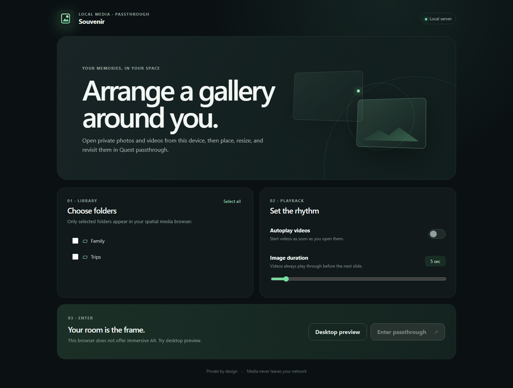
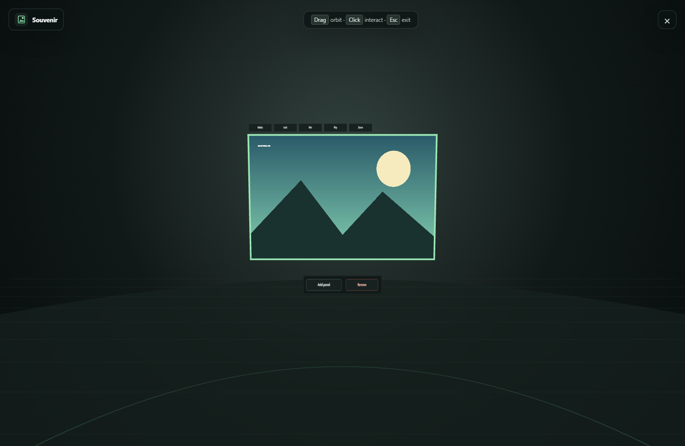
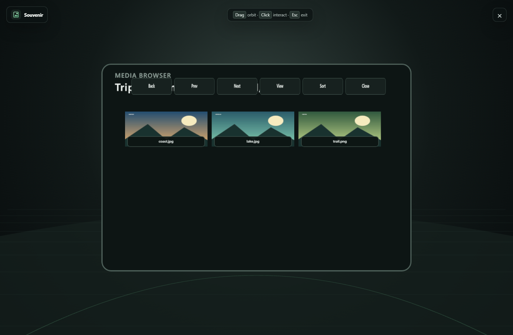

# Souvenir user guide

Souvenir is a private local-media gallery for Meta Quest 3. The server reads
photos and videos from one folder on your computer; Quest Browser displays them
as movable panels over passthrough. Media remains on the local network.

Supported formats are JPEG, PNG, WebP, GIF, MP4, and WebM.



## 1. Install and start Souvenir

### Requirements

- Python 3.11 or newer
- Node.js 20.19 or newer
- A computer and Quest 3 on the same local network
- Meta Quest Browser with hand tracking enabled

From the Souvenir folder, install the server and build the local web app:

```bash
python -m venv .venv
source .venv/bin/activate
python -m pip install -r requirements.txt
npm install
npm run build
```

On Windows PowerShell, activate the environment with:

```powershell
.\.venv\Scripts\Activate.ps1
```

Choose the folder that contains your media and start Souvenir:

```bash
SOUVENIR_MEDIA_HOME=/path/to/gallery ./start.sh
```

To enable optional commentary, point `SOUVENIR_COMMENTARY_DIR` at a separate
audio folder:

```bash
SOUVENIR_MEDIA_HOME=/path/to/gallery \
SOUVENIR_COMMENTARY_DIR=/path/to/commentary \
./start.sh
```

Commentary supports WAV, MP3, OGG/Opus, M4A/AAC, and WebM audio that Quest
Browser can decode.

The default port is `8000`. Set another port when necessary:

```bash
SOUVENIR_MEDIA_HOME=/path/to/gallery SOUVENIR_PORT=5000 ./start.sh
```

On Windows, where `start.sh` is not available, use:

```powershell
$env:SOUVENIR_MEDIA_HOME = "D:\Pictures"
python -m server --host 0.0.0.0 --port 8000 --https
```

The terminal stays open while the server runs. Find the computer's LAN IP
address, such as `192.168.1.42`, and open
`https://192.168.1.42:8000` in Quest Browser.

### Reload server code without closing clients

The terminal process supervises the serving worker. After changing server code
or rebuilding the web app, type the literal command below in the running
Souvenir terminal and press Enter:

```text
\r
```

Souvenir gracefully stops the current worker and starts a fresh one on the same
host and port. Open Quest and desktop browser pages remain open and reconnect
when the new worker is ready. This restart also runs a fresh first-load media
scan. Press `Ctrl+C` to stop both the worker and supervisor completely.

### Trust the local certificate on Quest

Immersive WebXR works only in a secure HTTPS context. On first start, Souvenir
creates these files inside `<media home>/.souvenir-certs/`:

- `ca.pem`: the public Souvenir Local CA certificate
- `ca-key.pem`: the private CA key
- `server.pem` and `server-key.pem`: the HTTPS server identity

Keep `ca-key.pem` and `server-key.pem` private. Copy **only `ca.pem`** to the
Quest, for example through USB or Meta Quest Developer Hub, rename it to
`Souvenir-CA.crt` if the Quest file picker requires a `.crt` extension, and use
the Quest/Android **Install a CA certificate** flow to install it. The exact
Settings path can vary by Quest OS release; look under **Security and privacy →
Encryption and credentials**, or open the certificate from the Files app.

Restart Quest Browser after installation. The address bar should then show a
trusted HTTPS connection. The installed CA is valid only for this local
Souvenir instance. Souvenir automatically extends its server certificate when a
new LAN address is detected while preserving the trusted CA.

Remove the installed **Souvenir Local CA** from Quest credentials when Souvenir
is no longer used. If `.souvenir-certs` is deleted, Souvenir creates a new CA
and the new `ca.pem` must be installed again.

## 2. Configure the gallery

When the server starts, it scans the media home once. The terminal reports when
the scan starts, periodic file/media/folder totals for larger libraries, and a
completion summary. The home page shows the same live counts and current
relative path. Gallery launch buttons remain disabled until the scan and folder
loading complete. If scanning fails, check the actionable message on the home
page and the detailed server log.

The Portal is bounded to the current browser window. On desktop, the Library,
Playback, Tags, and Commentary sections each have a maximize control that fills
the Portal configuration area. Use the same control again or press `Escape` to
return to the four-panel dashboard. On narrow screens, the panels also become
accordions: open one section at a time with its **+** button, then maximize it
when you want that section to use all available configuration space.

The home screen includes these panels:

1. **Choose folders** limits the spatial browser to selected media-home
   subfolders. Only top-level folders are shown initially; use the arrow beside
   a folder to expand or collapse its children. Selecting or clearing a folder
   applies to all of its descendants. A partially selected parent shows an
   indeterminate checkbox. Collapsing a folder does not change its selections,
   and nested folders return to their collapsed state after a reload. If
   nothing is selected, the entire media home is available. **Select all/Clear**
   changes every folder at once.
2. **Autoplay videos** controls whether a normally selected video starts
   immediately.
3. **Image duration** sets how long images remain visible during a slideshow.
   Videos in a slideshow always play to completion before advancing.
4. **Organize shared tags** defines reusable labels such as Horse, Blue, or
   Portrait. Enter a name and choose **Add**; existing definitions can be
   renamed or deleted. Definitions are stored by the server and are shared by
   every panel and browser client using this media home. Deleting a definition
   also removes it from media assignments and saved panel filters. Definitions
   and assignments live in `<media home>/.souvenir-tags.json`; this same atomic
   metadata file also stores commentary tag assignments, captions, and volume.
   Include it when backing up any of those features.
5. **Commentary** appears when `SOUVENIR_COMMENTARY_DIR` is configured. It lists
   audio recursively in a compact, internally scrolling list and lets you
   explicitly Play/Stop one test sound at a time. Assigned tags appear beside
   each filename. Use **All**,
   **Untagged only**, or one or more tag chips to filter the sound list; multiple
   selected tags use AND matching. Choose **Captions** on a sound to enter its
   caption sequence in an overlay and save it on the server. Plain text
   is one caption message; separate messages with `#` characters. Every message
   appears for one second, and every `#` inserts a one-second gap in the caption
   timeline while the audio continues normally. For example,
   `Welcome##Look left` displays “Welcome” for one second, leaves captions blank
   for two seconds, then displays “Look left” for one second. Choose **Tags** and
   check definitions to save a separate commentary assignment on the server.
   Tags and Captions open mutually exclusive overlays; choose **Close** to
   dismiss an unfinished edit. Without a configured directory, the card explains
   how to enable it; an empty or failed commentary library never disables
   gallery launch.
   Each compact sound row also has a **Volume** slider. Its saved 0–100% level is
   applied both to portal test playback and automatic AR commentary, which lets
   you reduce louder recordings to match quieter source recordings.
6. Use **Caption size**, **Transparency**, and **Distance** in the Commentary
   card to control the AR caption card on this device. These display preferences
   are saved in the browser with the other portal settings. Transparency ranges
   from fully opaque to 80% transparent, keeping captions readable.

Folder choices, playback preferences, and caption-display preferences are saved
in Quest Browser and restored on the next visit. Shared tags, assignments,
captions, and per-sound volume are server-owned and follow the media library
instead of one browser.

The title bar offers three ways to open Souvenir:

- **Browse mode** opens a conventional desktop media browser.
- **Desktop preview** runs the spatial gallery scene with mouse input.
- **Enter passthrough** requests immersive AR and the browser's passthrough and
  hand-tracking permissions.

### Browse mode

Browse mode lists images, videos, and reachable subfolders from the folders
selected on the Portal. If no folders are selected, the full media home remains
available. Use the breadcrumbs or **Up one folder** to navigate, and use the
Sort and Show controls to reorder the current folder or limit it to images or
videos.

Select one item by clicking its thumbnail. Hold Ctrl (Windows/Linux) or Command
(macOS) to toggle additional items, or Shift-click to select a range. **Select
all** selects the visible media in the current folder. The Shared Tags panel
edits every selected image or video together: checking a tag adds it to all
selected items, and clearing it removes it from all selected items. A partially
assigned tag first appears indeterminate.

Choose **Preview** to open a file. Videos use the browser's standard playback
controls. Images start fitted to the window and support:

- the **+**, **-**, and **Fit** controls;
- mouse-wheel zoom centered on the pointer;
- pointer or touch drag to pan a zoomed image;
- two-finger pinch zoom and pan;
- Left/Right Arrow to move through the current media results; and
- `0` to fit, `+`/`-` to zoom, and Escape to close.

Use the back arrow in the Browse mode title bar, or press Escape outside a
preview, to return to the Portal.

## 3. Hand controls

Souvenir needs no controllers:

- **Point** with a hand to focus a panel or button. Focused panels show their
  controls.
- **Pinch** index finger and thumb to select a control or media item.
- **Pinch and move one hand** on an unlocked panel to move and reorient it. The
  point where your hand ray first intersects the panel becomes the grab point.
  Souvenir keeps that point at the same ray distance while your hand moves and
  turns, so the panel follows the ray without sliding away from the selected
  point.
- **Pinch two different points on the same unlocked panel** to grab it with both
  hands. Each selected point stays at its original hand-ray distance. Moving the
  two rays together moves and rotates the panel; spreading or closing them
  scales it at the same time, like holding a physical frame by two corners.
- On a locked panel, one-hand movement pans its content and a two-hand gesture
  zooms the content instead.

For reliable tracking, keep both hands in front of the headset and avoid
overlapping them.

## 4. Panels

The high-resolution **PANEL CONTROLS** window below the gallery contains:

- **Add panel** creates a new blank panel.
- **Remove** deletes the currently focused panel.
- **Set Environment** opens the environment chooser.
- **Commentary** enables or disables tag-aware commentary playback. It is
  disabled when the server has no commentary sounds.

Pinch and drag an empty part of its title bar/background to move and reorient
the window. In desktop preview, pointer-drag the title bar. Dragging action
controls does not move the window; the buttons remain selectable after the
window has been relocated.

### Choose an environment

Choose **Set Environment**, then select:

- **Normal** — no background effect.
- **Dark** — places a translucent black layer over passthrough.
- **Night** — darkens passthrough with a deep dusk-blue tint.
- **Underwater** — adds a blue/cyan tint and slow animated caustic bands for a
  gentle wavy impression.
- **Red** — darkens passthrough with a red filter.

The selection is saved with the spatial layout. The effect is rendered as a
transparent OpenXR application-background layer before virtual panels, so
panels and their media remain untinted.

WebXR does not expose the passthrough camera feed to web applications. These
modes therefore behave like colored glass over the real world rather than true
camera post-processing; Underwater animates the overlay but cannot distort the
camera image itself. Darkening works best on headsets reporting the
`alpha-blend` environment mode. Devices using additive blending can show the
color but cannot reliably darken passthrough.

### Commentary selection and playback

Commentary starts only after you explicitly select the **Commentary** button:

1. Souvenir collects tags from the current media in every open panel. A tag's
   count increases once per panel containing it.
2. Each sound's score is the sum of those counts for the tags assigned to that
   sound.
3. If any scores are positive, Souvenir keeps the three highest-scoring sounds
   and chooses randomly between them, weighted by score.
4. If every score is zero, it chooses uniformly from all available sounds.
5. When more than one eligible sound exists, it avoids immediately repeating
   the previous sound.

Only one audio element plays at a time. When a sound ends, Souvenir recomputes
scores from the panels currently open and chooses the next sound. Turning
Commentary off, leaving preview/XR, or encountering an unrecoverable playback
error pauses and clears the audio. The enabled state is intentionally not
restored after reload because browsers require a fresh user gesture for audio.
Before each sound starts, Souvenir applies that file's saved Portal volume.

If the selected sound has captions, each message follows the sound's playback
clock, so pausing or delayed playback cannot make the text drift. The caption
card stays at the configured distance directly in front of the current desktop
camera or Quest headset and continuously faces the viewer.

Each focused full panel has nine controls along its top:

- **Media** opens the media browser.
- **Lock** freezes position, orientation, and panel size. Hand movement now pans
  or zooms the content.
- **Min** turns the panel into a fixed-size movable thumbnail. Pinch the
  thumbnail to restore it. A thumbnail can be moved but not resized.
- **Play** starts or stops a slideshow using the panel's current directory and
  sort order.
- **Zoom** switches gestures between panel transformation and content
  pan/zoom without locking the panel.
- **Ratio** cycles the panel frame through **Native**, **1:1**, **4:3**,
  **3:2**, **16:9**, and **9:16**. The panel keeps its current width where
  possible and changes height; at size limits, both dimensions adjust to retain
  the selected ratio. Native follows the current picture's pixel aspect ratio.
  Changing pictures updates a Native panel automatically. While minimized, the
  new ratio is applied when the thumbnail is restored.
- **Erase BG** opens draw-mask mode for the current picture or video.
- **Mask** enables or disables that media's saved transparency mask on this
  panel. The choice is saved with the panel; other panels keep their own toggle
  state.
- **Tags** opens the current media's tag dropdown. Select any number of
  predefined tags; selected entries show a check mark. Assignments are saved on
  the server and appear when the same media is opened in another panel or
  client. Use Prev/Next for longer definition lists and Close when finished.

Pinch the leftmost 25% of a populated panel for the previous item or the
rightmost 25% for the next item. Navigation wraps around the current directory.
Pinching the center of a video toggles play/pause.

Double tap nearly the same point on a picture to cycle its display mode:

- **1:1** uses the image's native size at 1,000 pixels per metre and crops only
  when it is larger than the panel.
- **Fill** covers the complete panel and center-crops overflow.
- **Fit** shows the complete image without stretching and leaves frame space
  where the aspect ratios differ.

The mode briefly appears in the panel corner and is saved with the layout.
A single picture tap still performs previous/next navigation after the short
double-tap detection interval. Video taps remain immediate.



## 5. Erase a media background

Souvenir can save one reusable transparency mask for each picture or video:

1. Load the media and choose **Erase BG**.
2. Pinch and hold on Quest, or hold the desktop pointer, then draw over the
   regions to erase. The working mask appears in pink. Drawing follows the
   underlying source even when the panel uses Fit, Fill, 1:1, content zoom, or
   content pan.
3. Point around the image to preview the pink brush outline, then use the
   **Brush** slider to set its size.
4. Use the **Blur** slider to soften or sharpen the edge around the complete
   mask. The painted mask remains binary and fully erased; blur only feathers
   its outer boundary.
5. Choose **Auto Mask** to request a server-generated background mask for the
   current picture. While generation is in progress, the mask is locked, grayed
   out, and outlined with a pulsing glow; choose **Auto Mask** again to cancel.
6. Choose **Apply** to save and activate the mask, **Cancel** to discard the
   current edit, or **Clear**, then **Apply**, to delete the saved mask.

Panel movement and media navigation are disabled while drawing. Starting the
editor stops that panel's slideshow; changing media cancels an unfinished edit
instead of saving it to the wrong file.

Auto Mask is available for pictures only, but applied masks work with both
pictures and videos. To reduce GPU memory and processing time, the server runs
segmentation on an aspect-preserving copy no larger than 512 pixels on either
axis, restores the generated mask to the source picture dimensions, and then
softens its edges. The server stores normalized
mask PNGs and blur metadata under
`<media home>/.souvenir-masks/`. This internal folder is not exposed in the
gallery. Include it when backing up the media home if you want to preserve
masks. Once saved, a mask is loaded automatically whenever that media appears
in any existing or new panel. New panels apply masks by default; use **Mask** to
turn one off locally without deleting the shared server mask.

## 6. Browse media

Choose **Media** on a panel. The spatial browser opens at that panel's last
directory, or at the first selected home-screen folder.



Pinch and drag an empty part of the browser header/background to move and
reorient the browser window. Grab two empty points to move, rotate, and scale it
with the same fixed-ray interaction as media panels. On desktop preview, drag
the same empty area to move it. Buttons and media tiles remain selection targets
and do not move the window.

The directory bar keeps a working directory (**CWD**) separate from a temporary
subdirectory preview. It only offers folders enabled on the portal:

- **Up** makes the CWD's parent the new working directory.
- **Subdir ▾** opens a paginated dropdown of the CWD's enabled direct
  subdirectories. Choosing one makes it the new CWD, allowing you to drill down.
- **<** previews the previous direct subdirectory without changing the CWD. From
  the CWD itself, it starts at the last subdirectory.
- **>** previews the next direct subdirectory without changing the CWD. From the
  CWD itself, it starts at the first subdirectory.
- **.** returns the media view from a subdirectory preview to the CWD.

Only media from the displayed directory appears in the content grid; folders
are never mixed into a flat media list. The remaining browser controls are:

- **Page -/Page +** move between pages in large directories.
- **View** cycles filename-only, thumbnail, and large-preview layouts.
- **Sort** cycles filename, modified date (newest first), size (smallest first),
  and random order.
- **Filter Tags** opens a multi-select tag filter. A media item is shown only
  when it contains **every** selected tag (AND matching). Select multiple tags,
  use **Clear** to remove the filter, and Close to return to the grid. Directory
  controls remain available even when no media in the displayed folder matches.
- **Close** returns without changing media.

Random order uses a seed saved in browser storage, so it remains stable across
Portal visits as well as during previous/next navigation and slideshows. A
panel's selected tag filter is saved with its layout and also limits
previous/next navigation and slideshow playlists. Pinch
a media item to place it on the current panel. If tags on the currently
displayed item change so it no longer passes the filter, it
may remain visible until the next selection/navigation; subsequent items still
come only from the filtered playlist.

## 7. Slideshows and video

A slideshow uses the last playlist and sort order selected for that panel:

- Images advance after the configured image duration.
- Videos start automatically in slideshow mode and advance only after their
  `ended` event.
- **Play** stops the slideshow without clearing the current item.

Normal video selection follows the home-screen **Autoplay videos** preference.

## 8. Saved layouts

Souvenir saves panel transforms and dimensions; selected media and directory;
sort, view, tag filter, display mode, aspect ratio, and mask toggle; lock,
minimize, content pan/zoom, slideshow state, focused panel, and environment mode
in browser storage. Reloading the page or returning later restores the layout.

Layouts are scoped to the server's current media-home identity. If
`SOUVENIR_MEDIA_HOME` changes—for example, from `/g` to `/g/Intel`—Souvenir
starts a blank spatial layout instead of replaying old relative paths such as
`Intel/cm2/photo.jpg` against the new root. Home-screen folder preferences are
reconciled separately. Existing layouts created before library identities were
introduced reset once during migration.

If a saved file has been removed, Souvenir reports it and clears that panel's
missing selection. Clear the site's browser data to reset all settings and the
layout.

## 9. Desktop preview

Desktop preview is useful for arranging a test layout and checking the server:

- Drag empty space to orbit the camera.
- Click spatial controls and media.
- Drag a panel to move it.
- Use the mouse wheel over a panel to resize it; when locked or in Zoom mode,
  the wheel zooms its content.
- Press `Esc` or use the upper-right close button to return home.

Physical passthrough and optical hand tracking can only be validated on Quest.

## Troubleshooting

### Enter passthrough is disabled

- Confirm the page uses `https://`, not `http://`.
- Confirm Quest trusts `ca.pem`; restart Quest Browser after installation.
- Use the LAN IP covered by the current certificate.
- Confirm immersive WebXR and hand tracking are enabled in Quest settings.

### The certificate warning remains

- Check that the installed certificate is `ca.pem`, not `server.pem`.
- Confirm the computer and Quest clocks are correct.
- Restart Souvenir after a LAN address change, then reload Quest Browser.
- If the CA directory was deleted, install the newly generated `ca.pem`.

### The library is empty

- Confirm `SOUVENIR_MEDIA_HOME` points to an existing readable directory.
- Use supported file extensions.
- Clear folder selections on the home screen to expose the whole media home.
- Check the server terminal for a path or permission error.

### A video does not play

- Quest Browser must support the codec inside the MP4 or WebM container. H.264
  video with AAC audio in MP4 is the most broadly supported Quest choice.
- Try selecting the video and pinching the center once if normal autoplay is
  disabled.

### Commentary captions or volume are missing

- Confirm the sound still exists at the same relative path under
  `SOUVENIR_COMMENTARY_DIR`.
- Check that `<media home>/.souvenir-tags.json` is present and writable; it holds
  commentary tags, captions, and volume as well as media tags.
- Volume can attenuate a sound from 100% down to silence; it does not amplify
  above the source recording's original level.
- Captions appear only while Commentary is enabled and only during each
  one-second message window. `#` characters create blank caption intervals; they
  do not pause the audio.

### Hand input is unreliable

- Improve room lighting and keep hands in the headset cameras' field of view.
- Move panels slightly farther away if their controls overlap visually.
- Exit and re-enter passthrough after changing Quest hand-tracking settings.
